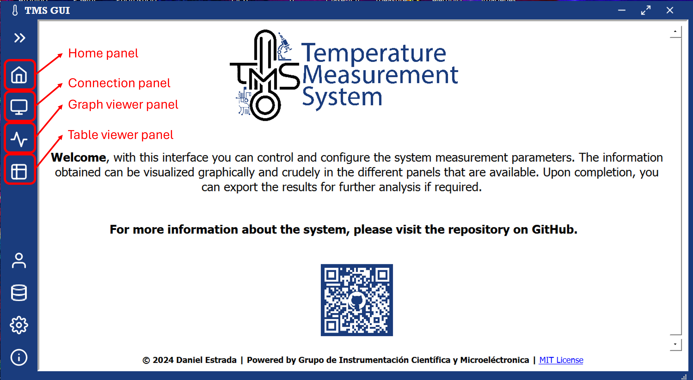

# Temperature Measurement System (TMS)

The documentation - User Manual for this system can be downloaded from [here](./TMS-User-Manual.pdf). There you will find complete information on how to connect the device and how to use the interface. Below is a brief summary of the most important points:

> [!Note]
> If you encounter any issues, bugs in the system, or simply need assistance, the recommended approach is to create an [issue](https://github.com/GICM-UdeA/TMS-public/issues/new) in this repository with the respective label (https://github.com/GICM-UdeA/TMS-public/labels/bug, https://github.com/GICM-UdeA/TMS-public/labels/documentation, https://github.com/GICM-UdeA/TMS-public/labels/help%20wanted, https://github.com/GICM-UdeA/TMS-public/labels/question).  

## Overview

The Temperature Measurement System (TMS) consists of a Data Acquisition Device (DAQ) based on Arduino and a Graphical User Interface (GUI) for control based on Python. The embedded system or hardware monitors include a set of six type K thermocouples at a configurable sampling rate. The records are sent to the user via serial communication through the desktop GUI as illustrated in figure 1.

Below is an image describing the components and connectors of the TMS device.

## How to Use

To use the system, you need to **install the dedicated software**. The latest available version can be downloaded from [here](./TMS_windows_v1.1_setup.exe).

The installation process is simple; you can see a step-by-step guide in the manual. In the end, you'll have a program on your computer that opens the following graphical interface.

From this interface, you have access to different panels that allow you to connect to the device and visualize the data graphically and in tables. In the connection panel (snippet a in the image), you can configure the parameters of serial communication. Make sure to select the correct port through which the device will send information. In case of Bluetooth connection, remember to follow the appropriate process to pair the device and check in the properties for the virtual COM port assigned by your computer (see the manual for more details).

Once the connection parameters are configured, you can use the "connect" button in the lower control panel that appears in any of the connection or visualization panels (right side of snippet c in the image).

The connection process may take several seconds, and if everything goes well, you'll see a message on the serial monitor of the connection panel indicating that the connection was successful, and default sampling parameters were applied.

> [!Warning]
> Sometimes the connection is not established fast enough, and the software will then display an error message like the one in the image. If this happens, simply retry the connection until successful. If the problem persists, you can try restarting the device and/or the interface.
>
> 

If the connection is successfully established, you can use the control panel (left side of snippet c in the image) to start data collection, stop it, clear the canvas, and export the measurements for further analysis.
